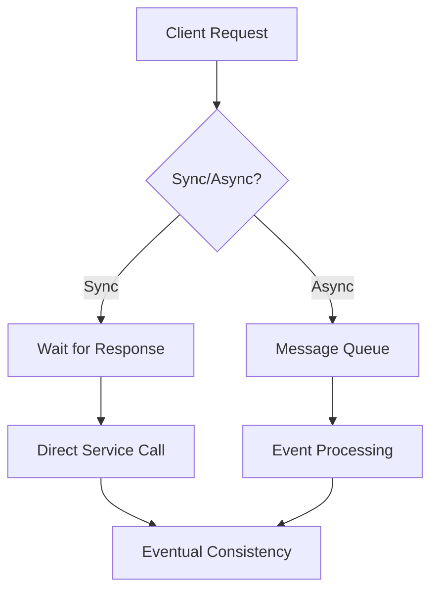

# Designing Distributed Systems

## Question
What principles guide distributed system design?

## Answer
Distributed systems require careful trade-offs between consistency, availability, and scalability.

### CAP Theorem
- **Consistency** - All nodes see same data
- **Availability** - System always responds
- **Partition Tolerance** - Handles network splits

**Key Insight**: Can only guarantee 2 of 3

### Trade-offs
| System | Consistency | Availability | Use Case |
|--------|-----------|---|----------|
| CP | Strong | Lower | Financial |
| AP | Eventual | High | Social Media |
| CA | Strong | High | Not viable |

### Consistency Models
- **Strong** - Most recent write visible
- **Eventual** - Eventually consistent
- **Causal** - Respects causality
- **Read-Your-Own-Write** - User sees own writes
- **Monotonic Read** - Consistency improves

### Communication Patterns
- **Synchronous** - Wait for response
- **Asynchronous** - Fire and forget
- **Publish-Subscribe** - Event-based
- **Request-Reply** - RPC pattern
- **Streaming** - Continuous data flow

### Common Challenges
- **Network Partitions** - Communication failures
- **Clock Skew** - Time synchronization
- **Cascading Failures** - Failure propagation
- **Data Loss** - Durability issues
- **Debugging** - Visibility problems

## Distributed System Patterns

## Key Points
- Embrace eventual consistency
- Design for failures
- Partition tolerance mandatory
- Monitor network health

## Interview Tips
- Discuss consistency trade-offs
- Explain failure scenarios
- Share distributed system experiences

## References
- [Designing Data-Intensive Applications](https://www.oreilly.com/library/view/designing-data-intensive/9781491902752/)
- [DDIA Blog](https://dataintensive.net/)
