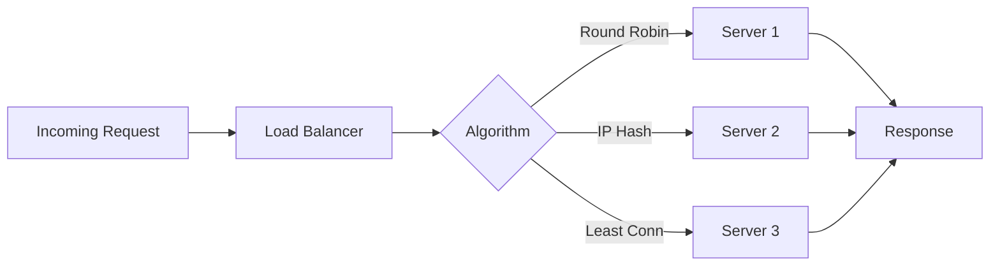

# Load Balancing Strategies

## Question
How do you distribute traffic across servers?

## Answer
Load balancing ensures efficient resource usage and high availability.

### Load Balancing Algorithms
- **Round Robin** - Sequential distribution
- **Least Connections** - Fewest active
- **IP Hash** - Client-based routing
- **Weighted Round Robin** - Server capacity
- **Random** - Probabilistic
- **Latency-based** - Response time

### Levels
- **L4 (Transport)** - TCP/UDP routing
- **L7 (Application)** - HTTP-aware routing
- **Geographic** - Location-based
- **Service Mesh** - Intelligent routing

### Load Balancer Placement
```
Users
  ↓
External LB (L4)
  ↓
Internal LB (L7)
  ↓
Service Instances
  ↓
Data Layer
```

### Health Checking
- **Passive** - Monitor failures
- **Active** - Regular health probes
- **Heartbeat** - Periodic signals
- **Custom** - Application-specific

### Sticky Sessions
- **None** - True load balancing
- **Cookie-based** - Session persistence
- **IP-based** - Client IP affinity
- **Timeout** - Automatic cleanup

### Tools
- **HAProxy** - High availability proxy
- **Nginx** - Web server and LB
- **AWS ELB** - Elastic load balancer
- **Kubernetes** - Service mesh
- **Envoy** - Proxy and LB

## Load Balancing Flow


## Key Points
- Algorithm choice depends on use case
- Health checking essential
- Monitor load distribution
- Plan for LB failures (HA pair)

## Interview Tips
- Explain algorithm trade-offs
- Discuss health checking
- Share load balancing experiences

## References
- [Load Balancing Guide](https://www.nginx.com/resources/glossary/load-balancing/)
- [HAProxy Documentation](https://www.haproxy.org/)
