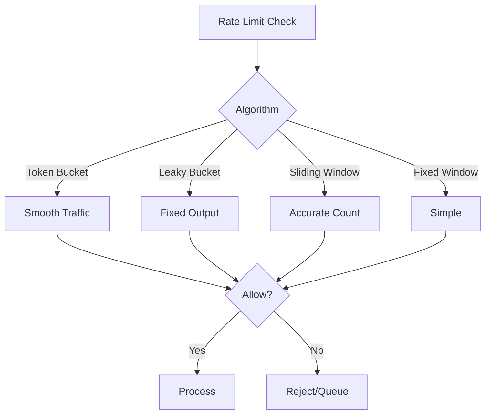

# Rate Limiting and Throttling

## Question
How do you implement rate limiting in distributed systems?

## Answer
Rate limiting controls request flow to protect system resources.

### Rate Limiting Algorithms
- **Token Bucket** - Smooth traffic flow
- **Leaky Bucket** - Fixed rate drain
- **Sliding Window** - Time-based counting
- **Fixed Window** - Simple counter
- **Adaptive** - Dynamic adjustment

### Token Bucket Algorithm
```
Tokens = min(Capacity, Tokens + RefilRate * Time)
If Tokens >= Request Cost:
    Tokens -= Cost
    Allow Request
Else:
    Deny Request
```

### Implementation Strategies
- **Client-side** - Self-limiting clients
- **API Gateway** - Server-side enforcement
- **Per-User** - Individual quotas
- **Per-IP** - IP-based limits
- **Per-Service** - Service-level limits

### Rate Limit Types
- **Requests per Second** - RPS
- **Concurrent Connections** - Simultaneous
- **Bandwidth** - Data rate
- **Computational** - CPU/Memory usage
- **Database** - Query limits

### Distributed Rate Limiting
- **Centralized Counter** - Redis
- **Distributed Tokens** - Shared state
- **Local Counters** - Approximate
- **Eventual Consistency** - Loose coupling

## Rate Limiting Algorithm Comparison


## Key Points
- Choose algorithm based on use case
- Distributed systems need consensus
- Monitor rate limit violations
- Communicate limits to clients

## Interview Tips
- Explain algorithm differences
- Discuss implementation trade-offs
- Share production patterns

## References
- [Rate Limiting Patterns](https://www.nginx.com/blog/rate-limiting-nginx/)
- [Scaling AWS Rate Limiting](https://aws.amazon.com/articles/rate-limiting/)
